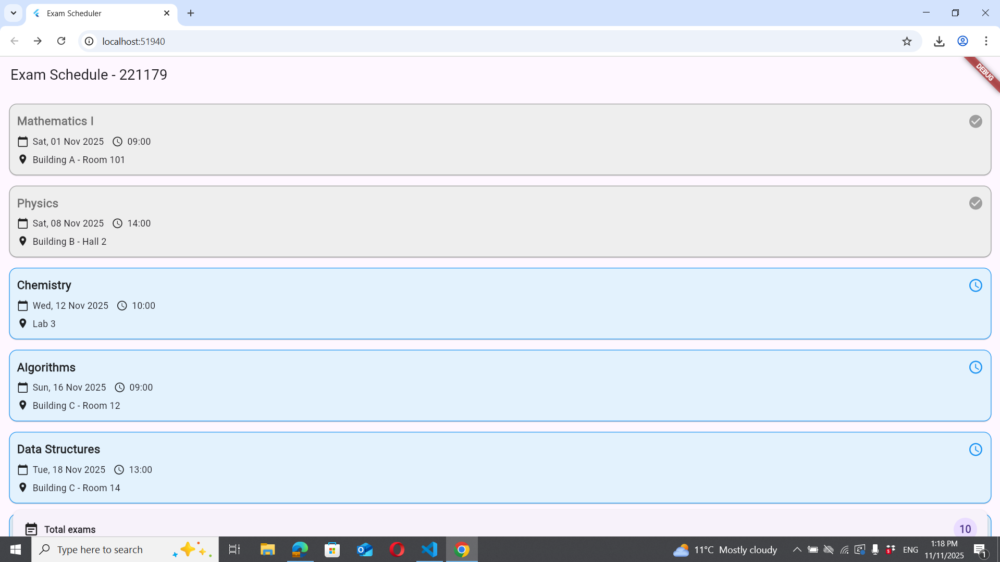
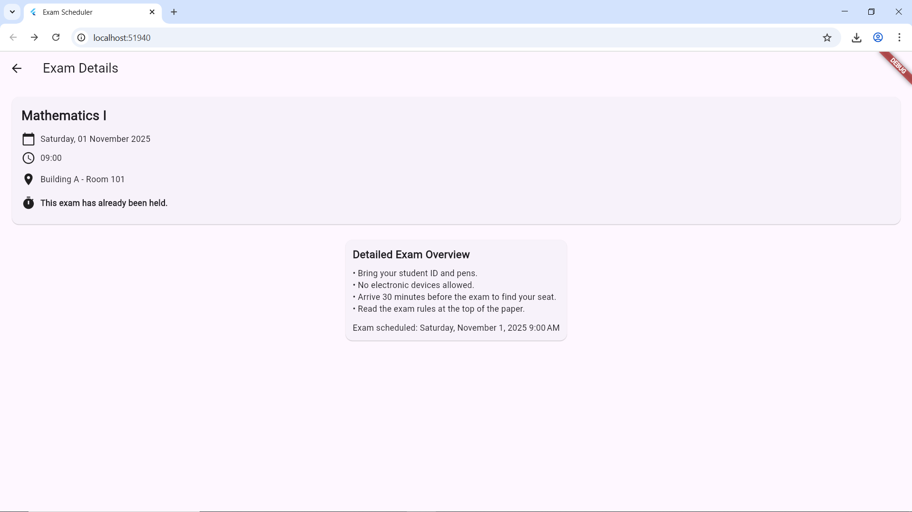

# Распоред на Испити (Exam Scheduler)

Ова е едноставна Flutter апликација која прикажува список на испити, организирани хронолошки.  
Секој испит е претставен преку **картичка (Card widget)** со предмет, датум, време и место на одржување.  
Со клик на картичка се прикажуваат сите детали за испитот и преостанатото време до неговото одржување.

---

### Функционалности
- Приказ на сите испити подредени по датум  
- Различни бои за **поминати** и **претстојни** испити  
- Детален преглед на секој испит со пресметка на преостанати денови и часови  
- Значка (badge) со вкупен број на испити  

---

### Screenshots
Сите слики од апликацијата се наоѓаат во папката [`/screenshots`](./screenshots).

| Почетен екран | Детален преглед |
|----------------|------------------|
|  |  |

---

### Како да ја стартувате апликацијата
```bash
flutter pub get
flutter run
